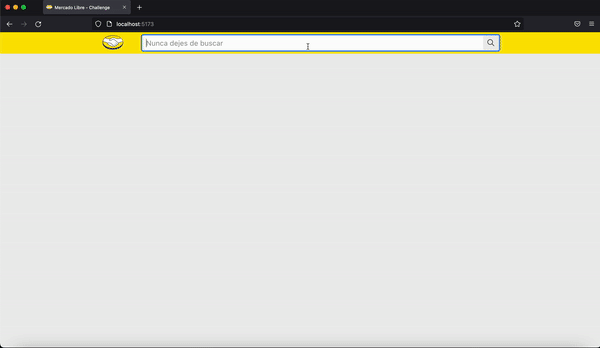
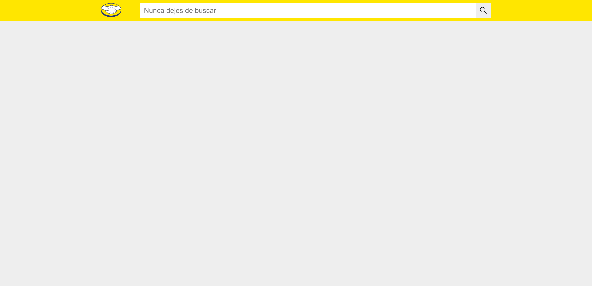
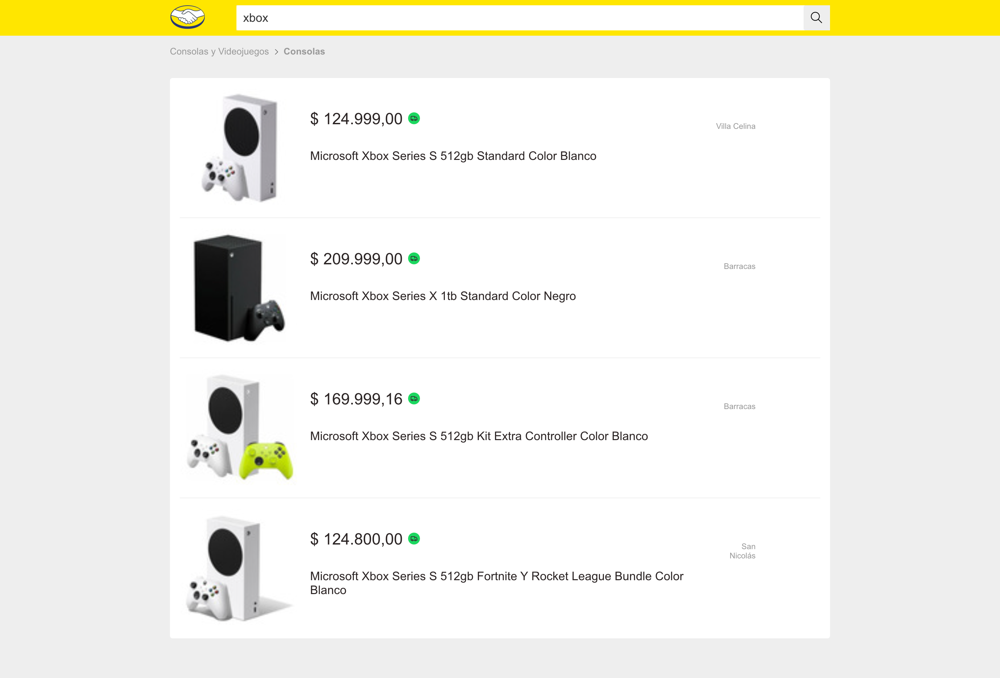
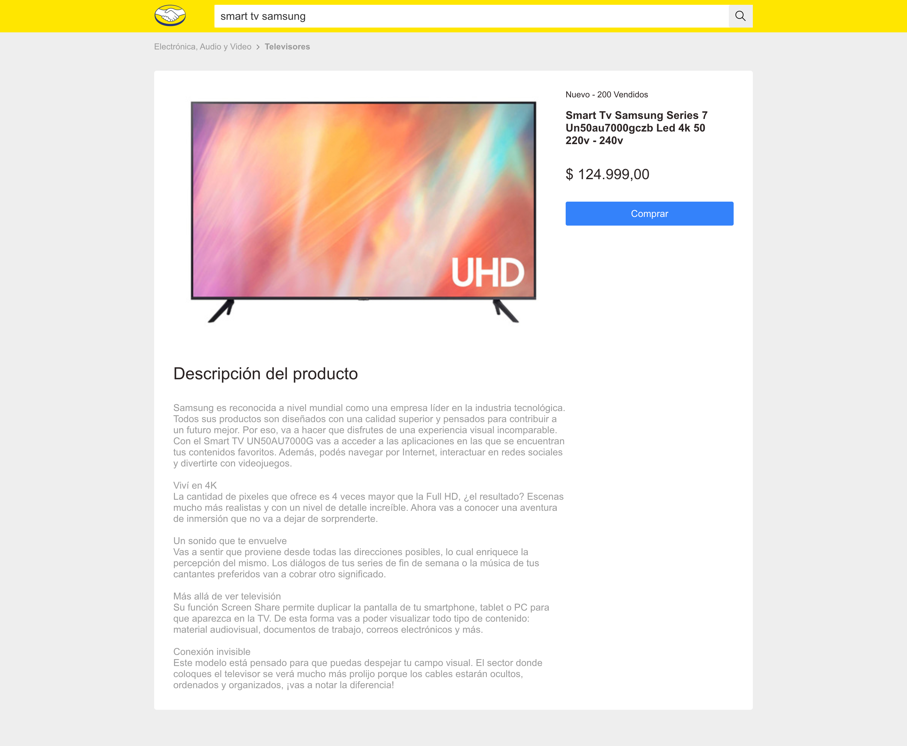
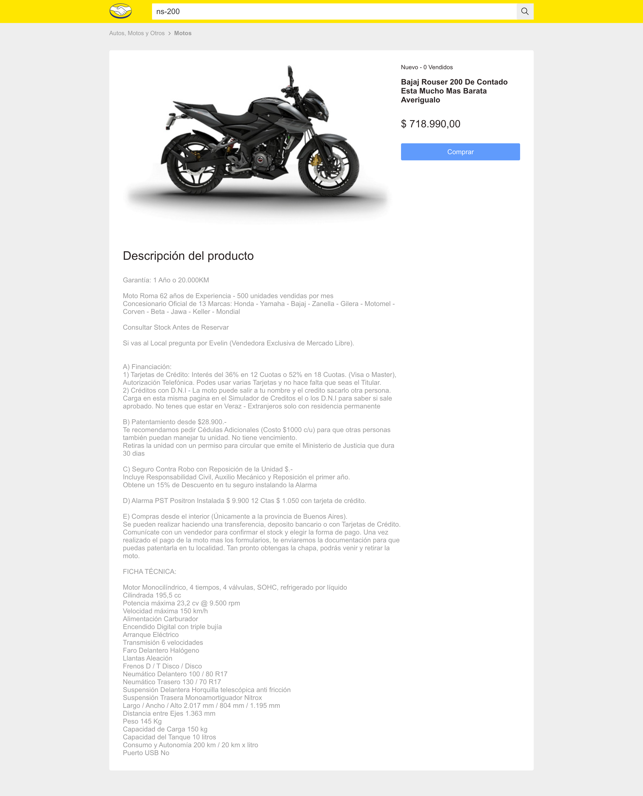

# Frontend Challenge Meli

    

## Description

This is a frontend challenge for Mercado Libre.

● Client:

- HTML
- React
- Typescript
- SASS

● Server:

- Node >= 6
- Express

## Screenshots

    <h3>Caja de búsqueda</h3>
    
    <h3>Resultados de la búsqueda</h3>
    
    <h3>Detalle del producto</h3>
    
    

## Installation

- `npm install`
- `npm run dev`
- Open `http://localhost:5173/`
